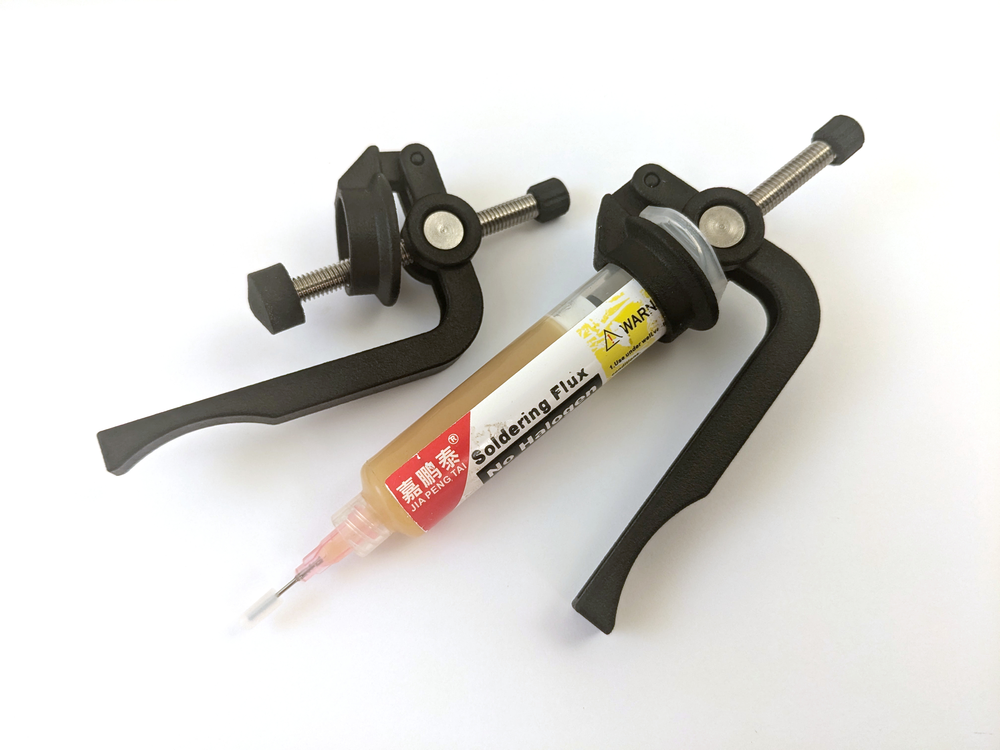

Simple Dispenser
===============

A rework of a popular dispenser from AliExpress, made to look more elegant
while practicing smoothed 3D parts design.

## Parts List

### 3D Printed

`.stl` files were printed at [jlc3dp](https://jlc3dp.com/). Consider these
material options:

- MJF, Nylon (black) - Nice surface and best durability. Min print cost is $1
  per part. Can be expensive.
- SLA, 9600 Resin (white) - Very cheap, but can be fragile and surface is
  easily soiled.

### Additional components

- [Barrel Nut](https://www.aliexpress.com/item/1005004941576015.html) - OD10 M6x12
  ([alternative option](https://www.aliexpress.com/item/1005007184987141.html),
  cheaper but less elegant)
- [M6 Shafts](https://www.aliexpress.com/item/1005007583195323.html) -
  Buy all these: 60/70/80/90/100 mm. If total length with full syringe is not
  a concern, buy 100 mm shaft only. Alternative: use M6 screw with cut head.

Optional:

- [Needle caps](https://www.aliexpress.com/item/1005006448901685.html)

## License

MIT / CC-BY